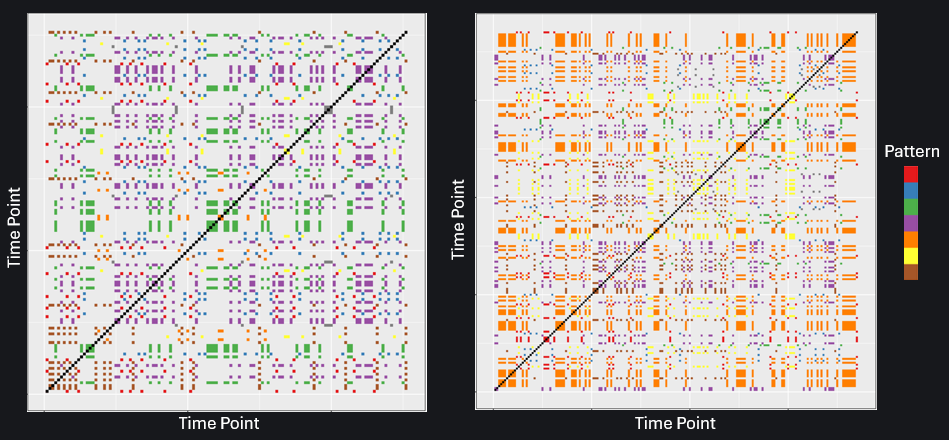

<figure style="text-align: center; margin: 0 auto;">
  
  <figcaption style="margin-top: 0.5em; font-style: italic;">
    These simulated recurrence plots show how patterns of coordination unfolded differently over time for two participants. The colored areas in the plot represent moments in time when the participants were in a repeated shared state (e.g., one person's HR was high while the other's was low and this state happened before) while the empty spaces represent when they were in a new state. The key on the right indicates which unique pattern they were in (e.g., both were high, both were low, one was high while the other was low, etc.). Comparing the two plots visually you can see that the team on the left occupied different patterns (predominatly purple and green) than the team on the right (e.g., predominately orange and purple). 
  </figcaption>
</figure>

 My research explores how teams function as complex adaptive systems—meaning they’re made up of many interconnected parts that interact and evolve over time. One of the biggest challenges in this work is figuring out how to represent a team. Some researchers focus on individual members and how their behaviors influence the group, while others model the team as a single unit to study how it functions as a whole. Each approach has its strengths and trade-offs. 

On top of choosing the right modeling technique, my team is especially interested in working with large, complex datasets. For example, in one project, we collected heart rate, posture, activity, and log file data at 32 samples per second over one hour from 14 participants. That’s **8,064,000 data points** per session! And because we ran this twice a day for ten days, we ended up with over **161 million data points** in total.

Working with this kind of data is no small task. It comes from many people, sensors, and systems—and it's often messy or incomplete. Traditional methods usually require lots of cleaning and reshaping before you can even start analyzing. To tackle this, I partnered with [Aaron Necaise](https://scholar.google.com/citations?user=IybuqwUAAAAJ&hl=en) and [Dr. Mary Jean Amon](https://luddy.indiana.edu/contact/profile/index.html?Mary~Jean_Amon) to develop a more flexible approach to **joint recurrence quantification analysis**, or jRQA, that handles imperfect data with fewer assumptions. jRQA is a technique for detecting shared patterns across time in multiple time series, revealing how systems evolve in relation to each other. You can see an example of a recurrence plot from traditional RQA in the image above. 

Our new method starts by modeling each team member their own nonlinear system. We analyze each team member on their own and then look at how their behavior relates to others over time—drawing on both individual and team-level modeling strategies. This makes it easier to uncover complex team dynamics, even when people are playing different roles or interacting in very different ways.

This project is still in progress, but we’re excited to share more soon—we’re aiming to submit the full paper in 2025! 

  <strong>Interested in collaborating or learning more about jRQA?</strong> 
  <a href="mailto:tkara.mullin@ucf.edu">Reach out via email</a> or 
  <a href="https://www.linkedin.com/in/tkara-mullins/">connect with me on Linkedin</a>.

<!--more-->
